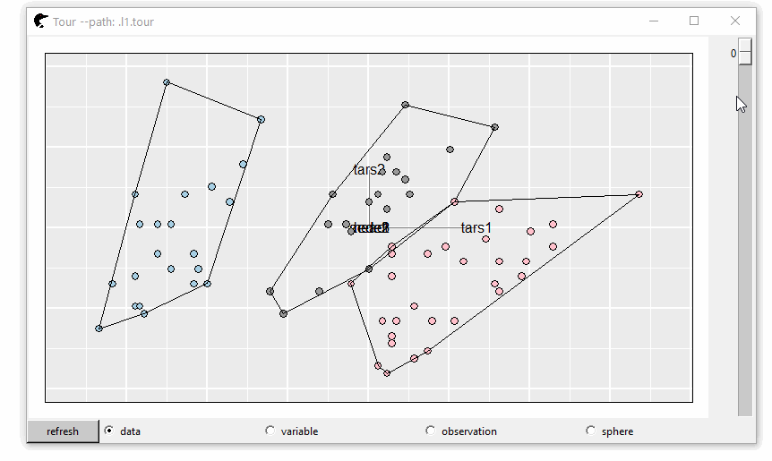
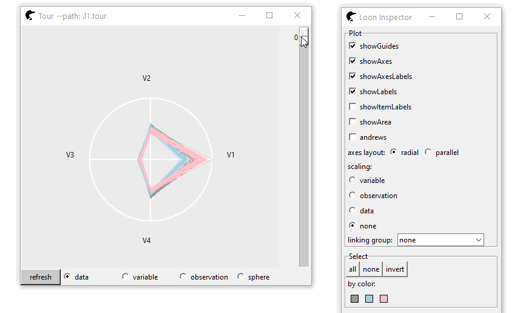
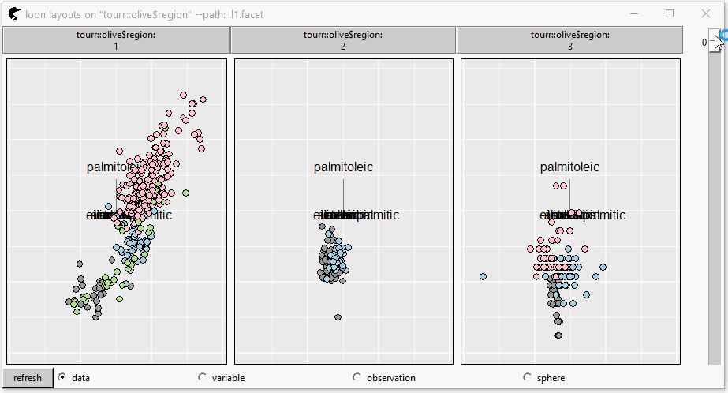
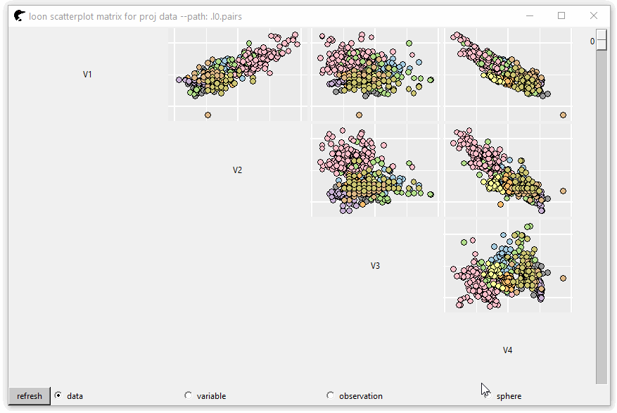

# loon.tourr 

[](https://travis-ci.com/great-northern-diver/loon.tourr)
[](https://cran.r-project.org/package=loon.tourr)

## Grand Tour

The grand tour (*D.Asimov*) is a mechanism to randomly select a 2D projection in a `p` column space. Transitions between two serial projections are interpolated so that the rotating motion is smooth. It was first implemented in XGobi, GGobi (*D.Cook*, *D.F.Swayne*, *A.Buja*), then in `R` (package `tourr` *H.Wickham*, *D.Cook* and et al.)

In our package, such high dimensional visualization mechanism is re-implemented in `loon`. A slider bar is provided. As we scroll bar, the data will be transformed from this projection to the next.

### Install

`loon.tourr` can be achieved directly from github repo

```
remotes::install_github("https://github.com/great-northern-diver/loon.tourr")
```

Documents: the documentation of `loon.tourr` is [here](https://great-northern-diver.github.io/loon.tourr/)

### A 2D projection

Colour represents the flea species. A convex hull is created to classify groups easily. 

```
library(loon.tourr)
fl <- tourr::flea[, 1:6]
p <- l_tour(fl, color = tourr::flea$species)
l <- l_layer_hull(p, group = tourr::flea$species)
```



The bottom radio buttons represent the scaling of the data; if the random projections are not satifying, press button `Reset`, new random projections will be created.

### A high dimensional projection

Beyond 2 dimensions, higher dimensional tours can also be created (displayed in radial axes, parallel axes or andrews plot). 

```
p <- l_tour(fl,
            tour_path = tourr::grand_tour(4),
            color = tourr::flea$species)
```



The future of our project is obscure. It can be an isolated package or be merged in `loon` as a demo.

### Set facets

The tour plot can be separated by some variables into multiple panels. 

```
p <- l_tour(tourr::olive[, -c(1:2)],
            by = tourr::olive$region,
            color = tourr::olive$area)
```



### Pairs plot

An n-D tour path with a scatter plot matrix.

```
p <- l_tour_pairs(tourr::olive[, -c(1:2)],
                  tour_path = tourr::grand_tour(4),
                  color = tourr::olive$area)
```




